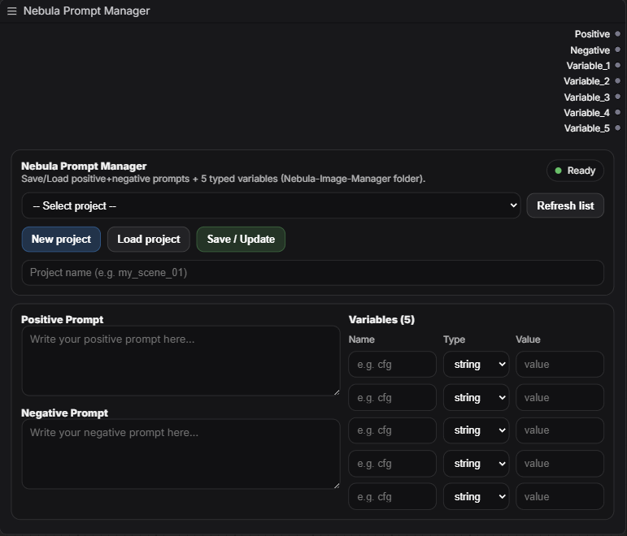

# Nebula Prompt Manager (ComfyUI Custom Node)

A clean, project-based **prompt manager** for ComfyUI that lets you store/load **Positive Prompt**, **Negative Prompt**, and up to **5 typed variables** per project — with **separate outputs** for easy wiring in workflows.

---
```md

```

---

## ✨ Features

* **Project-based storage**: Save each setup as a `.json` file
* **Two prompts**:

  * **Positive Prompt**
  * **Negative Prompt**
* **5 variable slots**:

  * Name + Type (`string | int | float`) + Value
  * Outputs return the typed value as `STRING`
* **Separate outputs (no concatenation)**:

  * `Positive`, `Negative`, `Variable_1..Variable_5`
* **Modern node UI**:

  * Dropdown list of saved projects
  * Buttons: **New project**, **Load project**, **Save / Update**, **Refresh list**
  * Dark-friendly dropdown styling (browser dependent)

---

## 📦 Installation

### Option A — Git Clone

1. Go to your ComfyUI custom nodes folder:

```bash
cd ComfyUI/custom_nodes
```

2. Clone the repository:

```bash
git clone https://github.com/<your-username>/NebulaImageManager.git
```

3. Ensure the structure is:

```
ComfyUI/custom_nodes/NebulaImageManager/
  __init__.py
  nebula_prompt_manager.py
  js/
    nebula_prompt_manager.js
```

4. Restart ComfyUI completely.

---

### Option B — Manual Installation

1. Download or copy the `NebulaImageManager` folder
2. Paste it into:

```
ComfyUI/custom_nodes/
```

3. Restart ComfyUI

---

## 🗂 Project Storage Location

All projects are stored as JSON files in:

```
<ComfyUI Root>/Nebula-Image-Manager/
```

Example files:

```
PortraitProject.json
AnimeWorkflow.json
ProductRender.json
```

---

## 🧠 Node Outputs

The node provides **7 outputs**, all of type `STRING`:

1. **Positive** → Positive Prompt text
2. **Negative** → Negative Prompt text
3. **Variable_1**
4. **Variable_2**
5. **Variable_3**
6. **Variable_4**
7. **Variable_5**

### Output behavior

* Empty variable rows output: `""`
* Typed conversion:

  * `int` → `30`
  * `float` → `0.5`
  * `string` → `hello`

---

## 🧩 Usage Guide

### Add the node

Search in ComfyUI:

**Nebula Prompt Manager**

Category: `Nebula`

---

### Create a new project

1. Click **New project**
2. Enter a project name
3. Fill:

   * Positive Prompt
   * Negative Prompt
   * Variables (optional)
4. Click **Save / Update**

A JSON file will be created automatically.

---

### Load an existing project

1. Select project from dropdown
2. Click **Load project**
3. UI updates instantly

---

### Refresh project list

Click **Refresh list** to detect newly created JSON files.

---

### Use outputs in workflow

Connect:

* `Positive` → sampler prompt input
* `Negative` → negative prompt input
* `Variable_1..5` → any downstream parameter nodes

---

## 🧾 JSON File Structure

```json
{
  "project": "PortraitProject.json",
  "positive_prompt": "cinematic portrait of a warrior",
  "negative_prompt": "blurry, watermark",
  "variables": [
    { "key": "CFG", "type": "float", "value": "7.5", "typedValue": 7.5 },
    { "key": "Steps", "type": "int", "value": "30", "typedValue": 30 }
  ]
}
```

---

## 🛠 Buttons Explained

### New project

Enables project name input for creating a new JSON file.

### Save / Update

Creates or overwrites project JSON file.

### Load project

Loads selected project into the UI and node inputs.

### Refresh list

Rescans project directory for new files.

---

## 🧪 Troubleshooting

### JSON not creating

* Ensure **Save / Update** is clicked
* Check folder exists:

  ```
  <ComfyUI Root>/Nebula-Image-Manager/
  ```
* Check ComfyUI logs for permission errors

### UI not updating after load

* Hard refresh browser
* Restart ComfyUI

### Dropdown colors not changing

Dropdown UI styling is OS/browser dependent. A dark scheme is applied but full control may vary.

---

## 🧑‍💻 Development Notes

* Backend routes:

  * `GET /nebula_image_manager/list`
  * `GET /nebula_image_manager/load`
  * `POST /nebula_image_manager/save`

* UI built using ComfyUI DOM widget extension.

---

## 📄 License

MIT (recommended)

---

## 🙌 Credits

Part of the **Nebula toolchain** for advanced ComfyUI workflows.
